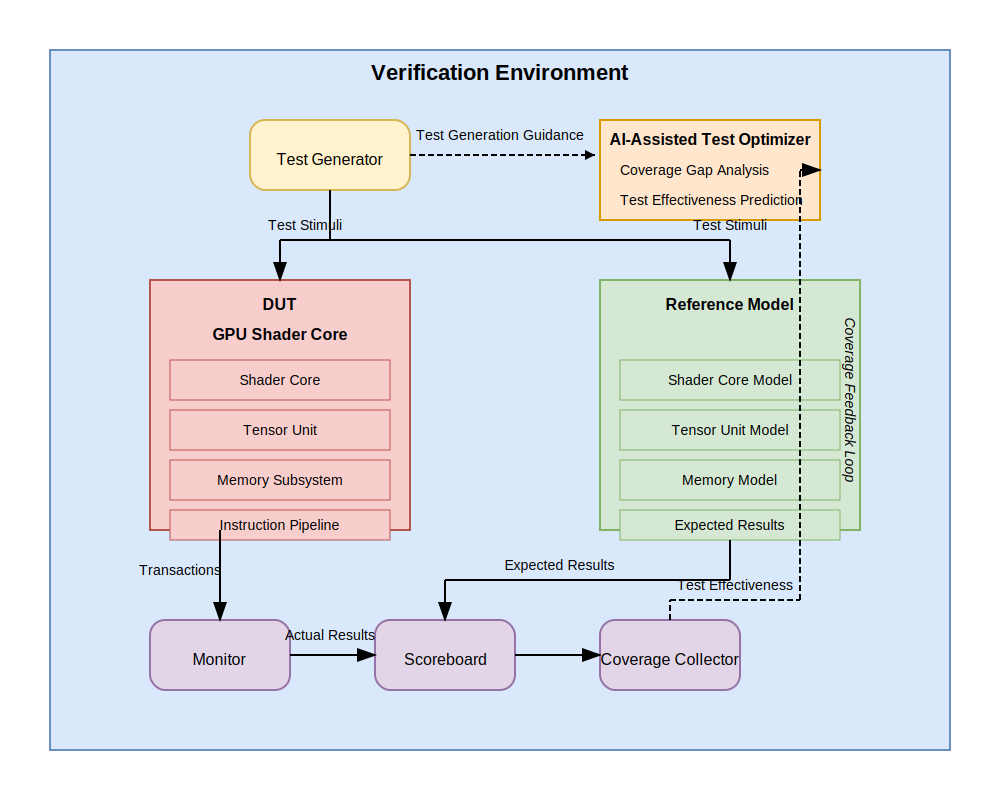

# GPU Shader Core Architecture

## Overview

This document describes the architecture of the GPU shader core reference model used in the verification framework. The model is implemented in SystemC and provides a simplified but representative view of a modern GPU shader core with tensor acceleration capabilities.

## Architecture Components

### 1. Shader Core

The shader core is the main processing unit that executes shader programs. It consists of:

- **Instruction Decoder**: Decodes instruction opcodes and prepares them for execution
- **Register File**: Stores temporary values during computation
- **Execution Unit**: Performs ALU operations
- **Tensor Unit**: Accelerates tensor operations
- **Memory Subsystem**: Handles memory operations


#### Instruction Pipeline

The shader core implements a simplified pipeline:

1. **Instruction Fetch**: Instructions are fetched from the instruction buffer
2. **Decode**: Instructions are decoded by the instruction decoder
3. **Execute**: Instructions are executed by the appropriate unit (ALU, tensor unit, memory)
4. **Writeback**: Results are written back to the register file

The pipeline supports stalling when necessary for multi-cycle operations.

### 2. Tensor Unit

The tensor unit is specialized for matrix and vector operations common in machine learning workloads:

- **Matrix Multiplication**: Optimized for various precisions (FP16, FP8, FP4)
- **Convolution**: Supports 2D convolution operations
- **Attention Mechanism**: Implements transformer attention blocks
- **Layer Normalization**: Supports normalization operations

#### Precision Support

The tensor unit supports different floating-point precisions:

- **FP32**: Standard 32-bit floating point
- **FP16**: Half-precision (16-bit) floating point
- **FP8**: 8-bit floating point (with reduced range/precision)
- **FP4**: 4-bit floating point (with minimal range/precision)

Lower precisions increase computational density at the cost of accuracy.

### 3. Memory Subsystem

The memory subsystem implements a hierarchical memory model with multiple levels:

- **Register File**: Fast, small storage for temporary values
- **Shared Memory**: Programmer-controlled scratchpad memory
- **L1 Cache**: First-level cache, private to the shader core
- **L2 Cache**: Second-level cache, shared across multiple cores
- **Global Memory**: Main system memory with HBM3e interface

#### HBM3e Memory Model

The global memory implements a High Bandwidth Memory (HBM3e) model with:

- Multiple channels (8 by default)
- High bandwidth (24 Gbps per channel)
- Realistic latency modeling
- Bank conflict simulation

## Instruction Set Architecture

### Instruction Format

Instructions are 32-bit values with the following format:

```
+--------+-----+-----+-----+---------------+
| Opcode | Dst | Src1| Src2|   Immediate   |
+--------+-----+-----+-----+---------------+
  31-26   25-21 20-16 15-11     10-0
```

- **Opcode (6 bits)**: The operation code
- **Dst (5 bits)**: Destination register
- **Src1 (5 bits)**: First source register
- **Src2 (5 bits)**: Second source register
- **Immediate (11 bits)**: Immediate value

### Instruction Types

The instruction set includes:

1. **ALU Operations**:
   - Arithmetic: ADD, SUB, MUL, DIV
   - Logical: AND, OR, XOR, NOT
   - Shifts: SHL, SHR

2. **Tensor Operations**:
   - TENSOR_MATMUL_FP16, TENSOR_MATMUL_FP8, TENSOR_MATMUL_FP4
   - TENSOR_CONV2D, TENSOR_ATTENTION

3. **Memory Operations**:
   - MEM_LOAD, MEM_STORE, MEM_ATOMIC

4. **Control Flow**:
   - BRANCH, BRANCH_COND, JUMP, CALL, RETURN

5. **Special Operations**:
   - BARRIER, SYNC, NOP

## Verification Architecture

The verification architecture follows a UVM-like approach with SystemC:

### Components

- **Test Environment**: Contains all verification components
- **Test Cases**: Define test scenarios
- **Monitors**: Observe transactions on interfaces
- **Scoreboard**: Compares expected vs. actual results
- **Coverage Collector**: Tracks verification coverage



### Transaction Flow

1. Test case generates stimuli
2. Stimuli are applied to DUT and reference model
3. Monitors capture transactions
4. Transactions are sent to scoreboard and coverage collector
5. Scoreboard compares results and reports mismatches
6. Coverage collector updates coverage metrics

## AI-Assisted Verification

The framework includes AI-assisted verification tools:

### Test Optimizer

The test optimizer uses machine learning (Random Forest) to:

1. Analyze past test effectiveness
2. Identify coverage gaps
3. Suggest new test configurations
4. Predict coverage impact of proposed tests

### Coverage Gap Analyzer

The coverage gap analyzer:

1. Identifies uncovered code/functionality
2. Suggests targeted tests
3. Visualizes coverage trends
4. Analyzes test effectiveness

## Edge AI Capabilities

The model includes specific features for edge AI workloads:

- **Low-precision Operations**: Supporting FP4/FP8 for efficient inference
- **Inference Optimizations**: Specialized configurations for inference
- **Quantization Support**: Simplified quantization mechanisms
- **Power-aware Execution**: Modeling of power-efficient operation modes

## Performance Considerations

The reference model is optimized for verification rather than performance:

- Memory access patterns are simplified
- Timing/cycle accuracy is approximate
- Parallelism is limited to SystemC's capabilities

However, realistic bottlenecks and behaviors are still represented:

- Cache misses have appropriate penalties
- Bank conflicts affect performance
- Complex operations take multiple cycles

## Extending the Architecture

The modular design allows for extensions:

- New instruction types can be added to the decoder
- Additional tensor operations can be implemented
- Memory hierarchy can be modified
- New specialized units can be added

## Future Enhancements

Planned architecture enhancements include:

1. **Ray Tracing Support**: For graphics workloads
2. **Sparse Tensor Acceleration**: For efficient ML computation
3. **Multi-core Simulation**: For thread-level parallelism
4. **Dynamic Precision Selection**: For adaptive compute

## References

1. NVIDIA GPU Architecture Whitepapers
2. CUDA Programming Guide
3. SystemC Language Reference Manual
4. IEEE 754 Floating-Point Standard
5. High Bandwidth Memory (HBM) Specification
